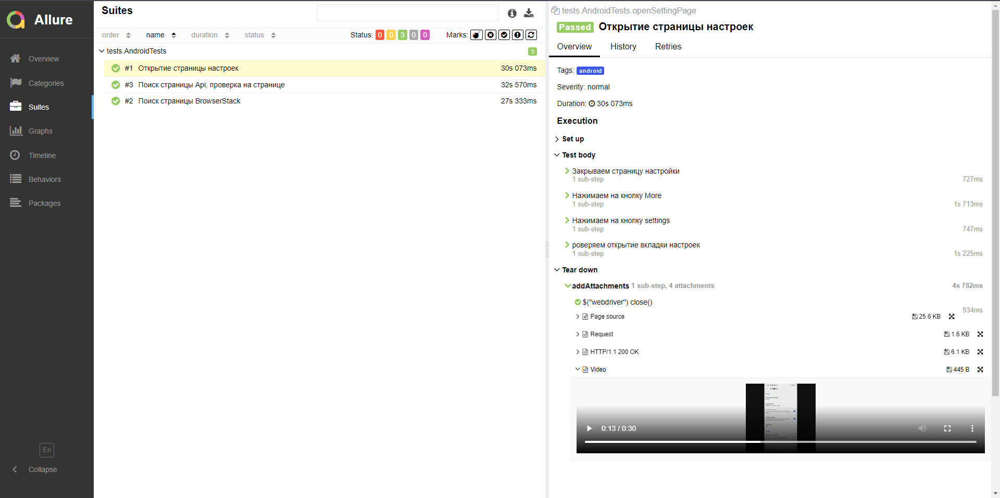

# Дипломный проект по тестирования мобильного приложения [Wikipedia](https://github.com/YevgeniyChuprov/diploma_project_mobile)

# <a name="Technology">Технологический стек</a>
<p  align="center">
  <code></code>
  <code></code>
  <code></code>
  <code></code>
  <code></code>
  <code></code>
  <code></code>
  <code></code>
  <code></code>
  <code></code>
  <code></code>
  <code></code>
  <code></code>
  <code></code>
</p>

Написан на `Java` с использованием фреймворка `Selenide`
Применяется фреймворк для модульного тестирования `JUnit 5`
`Gradle` используется для автоматизированной сборки проекта
`Browserstack` - для запуска мобильных тестов удаленно.
`Android Studio tools`, `Appium` - для запуска мобильных тестов локально на эмуляторе мобильных устройств.
Системы `Allure Report` и `Allure testops` формирут отчет о запуске тестов
`Telegram`-бот отправляет уведомление о результатах прохождения тестов

# <a name="HowToRun">Содержание тест-кейсов</a>

- [x] Проверка поиска (iOS)
- [x] Поиск страницы BrowserStack
- [x] Открытие страницы настроек
- [x] Поиск страницы Api, проверка на странице


# Запуск тестов
Для запуска тестов android:
```shell
gradle clean android -Denv=android
```

Для запуска тестов iOS:
```shell
gradle clean ios -Denv=ios   
```

Для локального запуска тестов:
```shell
gradle clean android -Denv=local  
```


## <a name="GradleCommand">Запуск с параметрами:</a>
```bash
clean
test
${PLATFORM}
"-Denv=${PLATFORM}"

```
###    Параметры сборки
```PLATFORM``` – Выбор платформы на которой будут запускаться тесты.


###   <a name="Запуск в Jenkins">Запуск в [Jenkins](https://jenkins.autotests.cloud/job/final_project_mobile_wiki/)</a>

Главная страница сборки:


Для запуска удаленных тестов необходимо заполнить параметры сборки:


###  <a name="Сформированный отчет Allure Report">Сформированный отчет **[Allure Report](https://jenkins.autotests.cloud/job/final_project_lamoda/17/allure/)</a>**

Основной дашборд:

 

Список тестов с результатами прогона:

 

###  <a name="Интеграция с Allure TestOps">Интеграция с [Allure TestOps](https://allure.autotests.cloud/launch/19783)</a>

Основной дашборд:


Список тестов с результатами прогона:


###  Уведомления в Telegram с использованием бота

  

К каждому тесту в отчете прилагается видео.
<p align="center">
  
</p>


